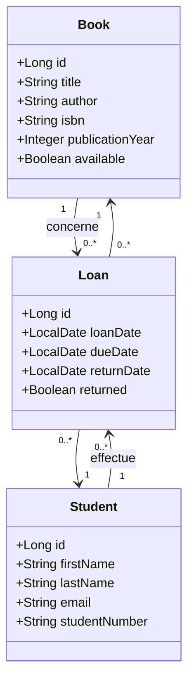

# Diagramme UML des entités — Cloud Library Manager

## Relations
- **Student → Loan** : One-To-Many (`@OneToMany(mappedBy = "student")`) — un étudiant peut avoir plusieurs emprunts.
- **Book → Loan** : One-To-Many (`@OneToMany(mappedBy = "book")`) — un livre peut être emprunté plusieurs fois au cours de son cycle de vie.
- **Loan → Book / Student** : Many-To-One (`@ManyToOne`) — un emprunt concerne un seul livre et un seul étudiant.
